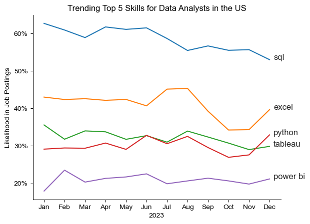
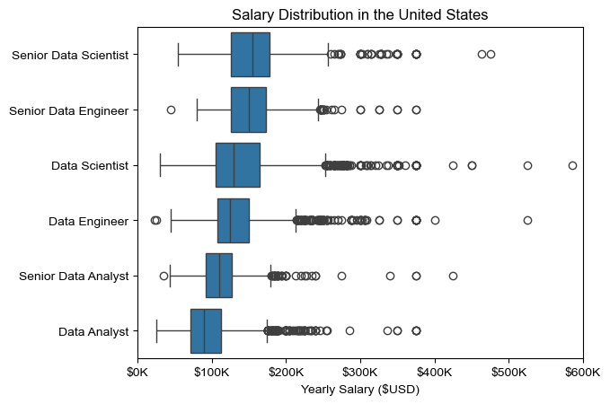
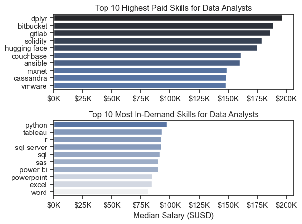
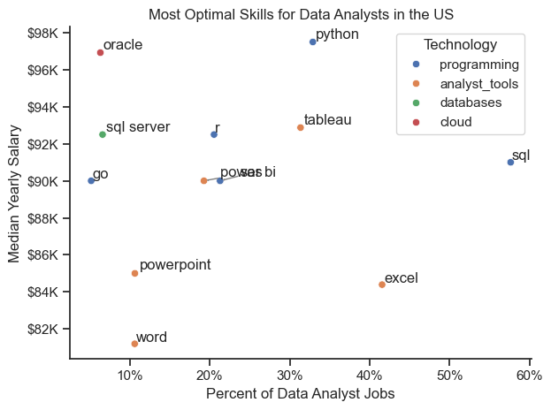

# Overview

This project presents an in-depth analysis of the data job market with a primary focus on data analyst roles. It was developed to better understand current market dynamics and to identify skill sets that enhance employability and earning potential. The analysis highlights both high-paying and high-demand skills to support more informed career decisions for aspiring and early-career data analysts.

The dataset used in this project is sourced from [Luke Barousse's Python Course](https://lukebarousse.com/python), which provides comprehensive information on job titles, salaries, locations, and required skills. Using a series of Python-based analyses, this project explores key trends such as skill demand, salary distribution, and the overlap between compensation and skill popularity within data analytics roles.

# The Questions

Below are the questions I want to answer in my project:

1. What are the skills most in demand for the top 3 most popular data roles?
2. How are in-demand skills trending for Data Analysts?
3. How well do jobs and skills pay for Data Analysts?
4. What are the optimal skills for data analysts to learn? (High Demand AND High Paying) 

# Tools and Technologies

To conduct this analysis, the following tools and technologies were utilized:

- **Python:** The core language used for data analysis and insight generation, along with the following libraries:
    - **Pandas Library:** For data manipulation and analysis.
    - **Matplotlib Library:** For building visualizations.
    - **Seaborn Library:** For creating advanced and visually appealing charts.
- **Jupyter Notebooks:** Used to execute Python code while documenting observations and findings.
- **Visual Studio Code:** The primary development environment for writing and running Python scripts.
- **Git & GitHub:** Employed for version control and project sharing, enabling effective tracking and collaboration.

# Data Preparation and Cleanup

This section details the steps taken to prepare the dataset for analysis, ensuring consistency, accuracy, and reliability.

## Import & Clean Up Data

The process begins by importing the required libraries and loading the dataset, followed by essential data cleaning steps to address inconsistencies and prepare the data for meaningful analysis.

```python
# Importing Libraries
import ast
import pandas as pd
import seaborn as sns
from datasets import load_dataset
import matplotlib.pyplot as plt  

# Loading Data
dataset = load_dataset('lukebarousse/data_jobs')
df = dataset['train'].to_pandas()

# Data Cleaning
df['job_posted_date'] = pd.to_datetime(df['job_posted_date'])
df['job_skills'] = df['job_skills'].apply(lambda x: ast.literal_eval(x) if pd.notna(x) else x)
```

## Filter US Jobs

To ensure the analysis reflects trends specific to the U.S. job market, the dataset is filtered to include only positions located in the United States.

```python
df_US = df[df['job_country'] == 'United States']

```

# The Analysis

Each Jupyter notebook in this project is dedicated to examining a specific dimension of the data job market. Below is an overview of how each research question was addressed.

## 1. What are the most demanded skills for the top 3 most popular data roles?

To identify the most in-demand skills across the three most popular data roles, I first determined which job titles appeared most frequently in the dataset. For each of these roles, I then extracted the top five skills based on their occurrence in job postings. This analysis highlights the core competencies employers prioritize and helps clarify which skills to focus on depending on the targeted role.

View my notebook with detailed steps here: [2_Skill_Demand](Python_Project/2_Skill_Demand.ipynb).

### Visualize Data

```python
fig, ax = plt.subplots(len(job_titles), 1)


for i, job_title in enumerate(job_titles):
    df_plot = df_skills_perc[df_skills_perc['job_title_short'] == job_title].head(5)[::-1]
    sns.barplot(data=df_plot, x='skill_percent', y='job_skills', ax=ax[i], hue='skill_count', palette='dark:b_r')

plt.show()
```

### Results


*Bar chart illustrating the most frequently requested skills for the top three data roles in the U.S. job market.*

### Insights:

- SQL is the most consistently requested skill for both Data Analysts and Data Scientists, appearing in over half of all job postings for these roles. In contrast, Python is the most in-demand skill for Data Engineers, featured in approximately 68% of postings.
- Data Engineer roles emphasize more specialized technical expertise, including cloud platforms and distributed systems such as AWS, Azure, and Spark.
- Data Analysts and Data Scientists are expected to demonstrate strong proficiency in general-purpose data analysis and visualization tools, including Excel and Tableau.
- Python stands out as a highly versatile skill, with strong demand across all three roles—particularly for Data Scientists (72%) and Data Engineers (65%).

## 2. How are in-demand skills trending for Data Analysts?

To examine skill trends for Data Analysts in 2023, I filtered the dataset to include only data analyst roles and grouped skill occurrences by the month in which job postings were published. This approach allowed me to identify the top five most requested skills each month and observe how employer demand evolved over time.

View my notebook with detailed steps here: [3_Skill_Trend](Python_Project/3_Skill_Trend.ipynb).

### Visualize Data

```python

from matplotlib.ticker import PercentFormatter

df_plot = df_DA_US_percent.iloc[:, :5]
sns.lineplot(data=df_plot, dashes=False, legend='full', palette='tab10')

plt.gca().yaxis.set_major_formatter(PercentFormatter(decimals=0))

plt.show()

```

### Results

  
*Line chart illustrating monthly trends in demand for the top data analyst skills in the U.S. throughout 2023.*

### Insights:
- SQL remains the most consistently in-demand skill throughout the year, despite a gradual decline in demand over time.
- Excel shows a notable rise in demand beginning in September, eventually surpassing Python and Tableau by year-end.
- Python and Tableau maintain relatively stable demand with moderate fluctuations, reinforcing their importance for data analyst roles.
- Power BI, while less frequently requested overall, exhibits a modest upward trend toward the end of the year, indicating growing relevance.

## 3. How well do jobs and skills pay for Data Analysts?

To assess compensation trends, the analysis focuses exclusively on job postings based in the United States and evaluates median annual salaries. As an initial step, I examined salary distributions across commonly listed data roles—such as Data Analyst, Data Scientist, and Data Engineer—to understand how pay levels compare across positions and seniority levels. This provided a foundation for identifying the roles and skill sets associated with the highest earnings. 

View my notebook with detailed steps here: [4_Salary_Analysis](Python_Project/4_Salary_Analysis.ipynb).

### Visualize Data 

```python
sns.boxplot(data=df_US_top6, x='salary_year_avg', y='job_title_short', order=job_order)

ticks_x = plt.FuncFormatter(lambda y, pos: f'${int(y/1000)}K')
plt.gca().xaxis.set_major_formatter(ticks_x)
plt.show()

```

### Results

  
*Box plot illustrating the distribution of annual salaries across the top six data job titles in the U.S.*

### Insights

- Salary ranges vary significantly by role and seniority. Senior Data Scientist positions demonstrate the highest earning potential, with salaries reaching up to $600K, underscoring the premium placed on advanced expertise and experience.

- Senior Data Scientist and Senior Data Engineer roles exhibit a substantial number of high-end outliers, suggesting that specialized skills, leadership responsibilities, or niche expertise can command exceptional compensation. In contrast, Data Analyst roles show more consistent salary ranges with fewer extreme outliers.

- Median compensation increases with both seniority and specialization. Senior-level positions not only offer higher median salaries but also display greater variability, reflecting broader differences in responsibility, scope, and organizational impact.

### Highest Paid & Most Demanded Skills for Data Analysts

In this stage of the analysis, I narrowed the scope to focus exclusively on data analyst roles. The objective was to compare the skills associated with the highest median salaries against those most frequently requested in job postings. To illustrate this comparison, I used two separate bar charts—one highlighting compensation and the other highlighting demand.

### Visualize Data

```python

fig, ax = plt.subplots(2, 1)  

# Top 10 Highest Paid Skills for Data Analysts
sns.barplot(data=df_DA_top_pay, x='median', y=df_DA_top_pay.index, hue='median', ax=ax[0], palette='dark:b_r')

# Top 10 Most In-Demand Skills for Data Analystsr')
sns.barplot(data=df_DA_skills, x='median', y=df_DA_skills.index, hue='median', ax=ax[1], palette='light:b')

plt.show()

```

### Results
Below is a comparison of the highest-paying and most in-demand skills for data analysts in the U.S. job market:



*Bar charts illustrating the top-paying skills and the most frequently requested skills for data analysts in the U.S.*

### Insights:

- The top chart indicates that specialized technical skills—such as dplyr, Bitbucket, and GitLab—are linked to higher median salaries, with some roles offering compensation approaching $200K. This suggests that advanced or niche technical expertise can significantly enhance earning potential.

- The bottom chart reveals that foundational tools, including Excel, PowerPoint, and SQL, remain the most in-demand skills despite offering comparatively lower salaries. These skills are essential for broad employability in data analyst roles.

- A clear distinction exists between skills that command higher pay and those that are most widely requested. To maximize career growth, data analysts should aim to develop a balanced skill set that combines specialized, high-paying competencies with core, in-demand tools.

## 4. What are the most optimal skills to learn for Data Analysts?

To determine the most optimal skills for data analysts—those that are both highly demanded and well-compensated—I analyzed the percentage of job postings requesting each skill alongside the corresponding median salary. This dual-metric approach makes it easier to identify skills that offer the strongest return on investment for career growth.

View my notebook with detailed steps here: [5_Optimal_Skills](Python_Project/5_Optimal_Skills.ipynb).

### Visualize Data

```python
from adjustText import adjust_text
import matplotlib.pyplot as plt

plt.scatter(df_DA_skills_high_demand['skill_percent'], df_DA_skills_high_demand['median_salary'])
plt.show()

```

### Results


*Scatter plot highlighting skills that combine high demand and high median salaries for data analysts in the U.S.*

### Insights:

- Oracle stands out with the highest median salary (nearly $97K) despite appearing less frequently in job postings, suggesting that specialized database expertise is highly valued.

- Widely requested skills such as Excel and SQL dominate job listings but tend to offer lower median salaries compared to more specialized tools like Python and Tableau, which balance strong demand with higher pay.

- Skills including Python, Tableau, and SQL Server occupy a favorable position on the chart, combining above-average salaries with steady demand—making them particularly strong choices for career advancement.

## Visualizing Different Techonologies

To further enhance the analysis, skills were grouped and color-coded by technology category (e.g., {Programming: Python}) to better understand how different skill types compare.

### Visualize Data

```python
from matplotlib.ticker import PercentFormatter

# Create a scatter plot
scatter = sns.scatterplot(
    data=df_DA_skills_tech_high_demand,
    x='skill_percent',
    y='median_salary',
    hue='technology',  # Color by technology
    palette='bright',  # Use a bright palette for distinct colors
    legend='full'  # Ensure the legend is shown
)
plt.show()

```

### Results



*Scatter plot showing optimal data analyst skills, segmented by technology category.*

### Insights:

- Programming skills (e.g., {Programming: Python}) tend to cluster at higher salary levels, indicating that coding expertise offers strong compensation advantages in data analytics.

- Database technologies, such as Oracle and SQL Server, are associated with some of the highest salaries, highlighting the premium placed on data management and backend expertise.

- Analytics and visualization tools, including Tableau and Power BI, are both widely requested and competitively paid, reinforcing their importance for modern data analyst roles.

# What I Learned

Through this project, I gained deeper insight into the data analyst job market while strengthening my technical and analytical skill set. Key takeaways include:

- **Advanced Python Usage**: Leveraging Pandas for data manipulation and Seaborn/Matplotlib for visualization enabled efficient and insightful analysis.
- **Data Cleaning Importance**: Proper data preparation is critical to producing accurate, reliable insights.
- **Strategic Skill Analysis**: Understanding how skill demand, compensation, and job availability intersect allows for more informed and strategic career planning.


# Overall Insights

This project surfaced several broader trends within the data analyst job market:

- **Skill Demand and Salary Correlation**:Skills that are both specialized and in demand—such as Python and Oracle—tend to command higher salaries.
- **Market Trends**: Skill requirements continue to shift, underscoring the importance of staying current with industry trends.
- **Economic Value of Skills**: Prioritizing skills that balance demand and compensation can significantly enhance long-term career outcomes.


# Challenges I Faced

While rewarding, the project presented several challenges that contributed to meaningful learning:

- **Data Inconsistencies**: Managing missing and inconsistent data required careful preprocessing to maintain analytical integrity.
- **Complex Data Visualization**: Effectively communicating insights through visuals demanded thoughtful design and iteration.
- **Balancing Breadth and Depth**: Balancing detailed analysis with a high-level perspective was essential to maintaining clarity and focus.


# Conclusion

This exploration of the data analyst job market provided valuable insights into the skills and trends shaping the field. The findings offer practical guidance for professionals seeking to strengthen their skill sets and remain competitive. As the data landscape continues to evolve, continuous learning and ongoing market analysis will be essential. This project serves as a strong foundation for future research and reinforces the importance of adaptability in data-driven careers.
